# Прохождение внешнего курса

В данном материале собраны результаты прохождения внешнего курса «Введение в Linux». В ходе выполнения заданий я последовательно изучила базовые и более продвинутые возможности операционной системы Linux: работу с терминалом, файлами и каталогами, стандартными потоками ввода и вывода, удалёнными серверами, многопоточными приложениями, менеджером терминалов `tmux`, редактором `vim`, `bash`-скриптами, утилитами поиска и обработки текста, а также средствами управления правами доступа.

# Этап 1. Введение

## Общая информация о курсе

Я указала название курса — «Введение в Linux».

В задании нужно было выбрать название курса из предложенных вариантов, что я и сделала.

Я прочитала условия прохождения курса и отметила все верные утверждения.

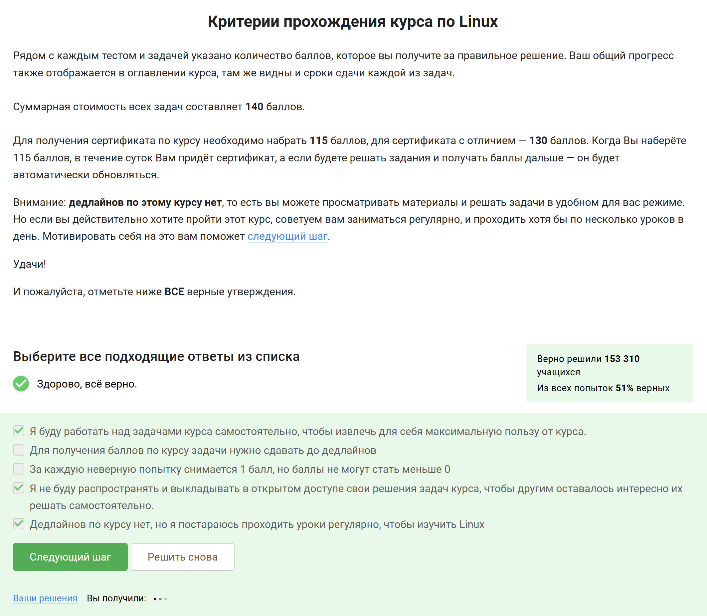

Мной были отмечены пункты о самостоятельном выполнении заданий, недопустимости публикации решений и отсутствии дедлайнов.

## Как установить Linux

Я указала, какие операционные системы обычно использую, отметила варианты «Linux» и «Windows».

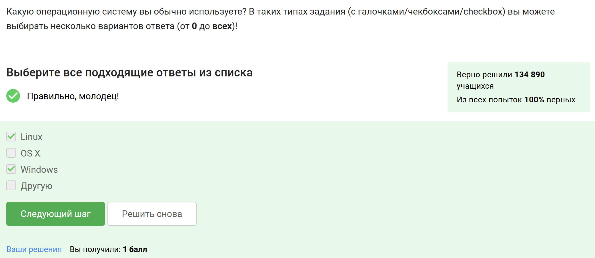

В задании требовалось выбрать все подходящие варианты ответа о том, какие операционные системы я использую обычно. Мной были отмечены варианты «Linux» и «Windows».

Я указала, что виртуальная машина — это специальная программа для запуска одной операционной системы внутри другой.

В задании требовалось выбрать один правильный вариант ответа о том, что такое виртуальная машина. Мной был выбран вариант о запуске одной ОС на другой ОС.

Я подтвердила факт запуска Linux на моём компьютере.

В задании требовалось подтвердить факт запуска Linux на компьютере. Так как система у меня уже давно была успешно запущена, мной был выбран вариант «Да».

## Осваиваем Linux

Я создала текстовый документ в LibreOffice Writer, ввела строку `Hello, Linux!`, сохранила файл в подходящем формате и загрузила его в систему.

Для выполнения задания мной был подготовлен документ со строкой `Hello, Linux!`, после чего он был сохранён в нужном формате и успешно загружен, что подтверждается зачётом решения.

Я указала, что установочные пакеты в Ubuntu имеют расширение `deb`.

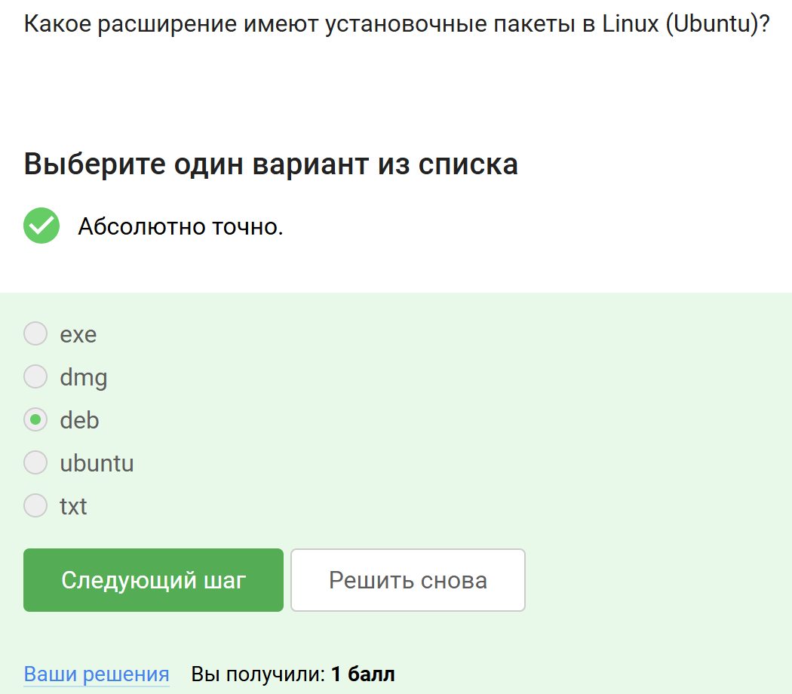

В задании требовалось выбрать расширение установочных пакетов, используемых в Ubuntu. Мной были рассмотрены предложенные варианты: `exe` относится в основном к Windows, `dmg` — к macOS, а `txt` и `ubuntu` не являются форматами установочных пакетов. Поэтому мной был выбран вариант `deb`, который используется в системах семейства Debian.

Я установила медиаплеер VLC, открыла окно с информацией о программе и определила первую фамилию во вкладке Authors, после чего ввела ответ в систему.

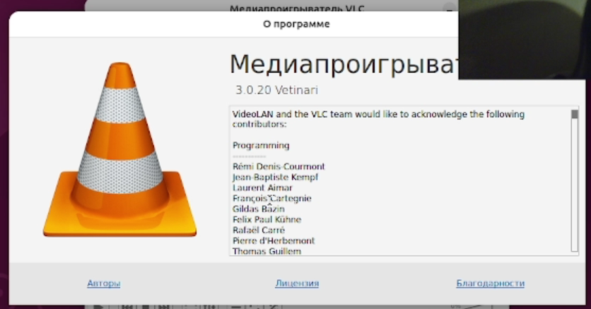

В задании требовалось установить VLC, открыть раздел `Help → About` и посмотреть вкладку Authors. Так как в списке авторов сначала указано имя, а затем фамилия, мной была определена первая фамилия — `Denis-Courmont`, после чего этот ответ был введён в поле на платформе и засчитан системой.

Я указала, что приложение Update Manager можно использовать для обновления ссылок в Software Center, обновления установленного программного обеспечения и обновления системы до новой версии.

В задании требовалось отметить все подходящие варианты использования Update Manager. Мной были исключены пункты про установку и удаление программ, так как для этого обычно используются другие средства управления пакетами. Остальные варианты связаны именно с обновлением системы и программ, поэтому они и были мной выбраны.

## Terminal: основы

Я отметила, что синонимами командной строки являются «Терминал» и «Консоль».

В задании требовалось выбрать все подходящие названия командной строки. Варианты «Ассоль» и «Термин» не относятся к работе в Linux, поэтому они были мной исключены. Подходящими вариантами являются «Терминал» и «Консоль», так как именно этими словами обычно называют интерфейс для ввода команд.

Я указала, что текущую директорию выводит команда `pwd`.

В задании требовалось выбрать правильное написание команды, которая показывает, в какой директории находится пользователь. В Linux имена команд чувствительны к регистру, поэтому варианты `Pwd` и `PWD` не подходят. По этой причине мной был выбран вариант `pwd`.

Я указала, что команде `ls -A --human-readable -l /some/directory` полностью эквивалентна команда `ls -lAh /some/directory`.

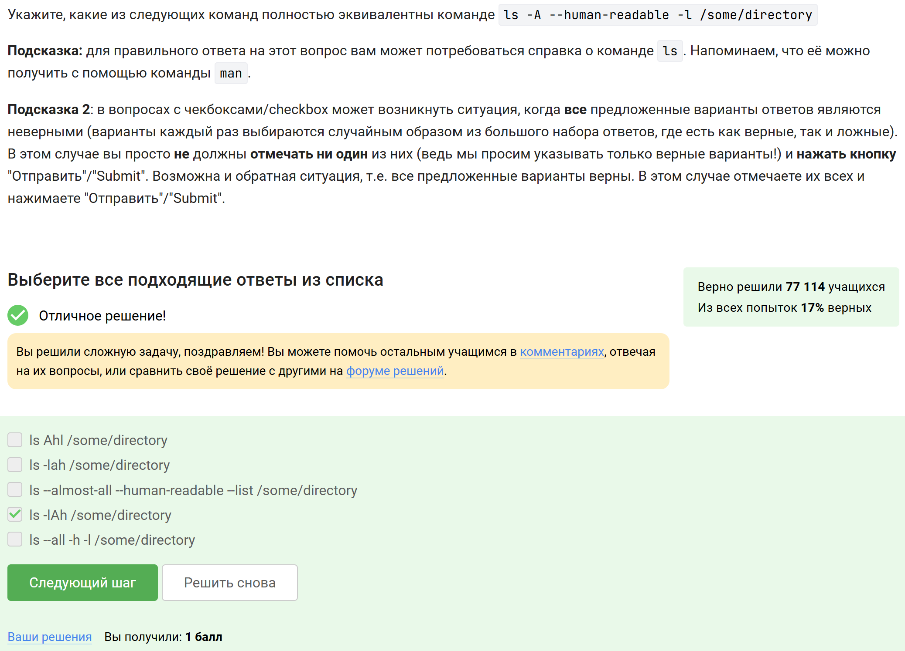

В задании требовалось найти полную эквивалентную запись команды `ls` с теми же параметрами. Для этого нужно было сопоставить длинные и короткие опции: `-A` соответствует выводу почти всех файлов без `.` и `..`, `--human-readable` соответствует ключу `-h`, а `-l` — длинному формату вывода. По этой причине мной был выбран вариант `ls -lAh /some/directory`, так как он содержит тот же набор параметров, только в сокращённой форме.

Я указала, что содержимое каталога `/home/bi/Downloads` в данной ситуации можно вывести командами `ls ../Downloads` и `ls ~/Downloads`.

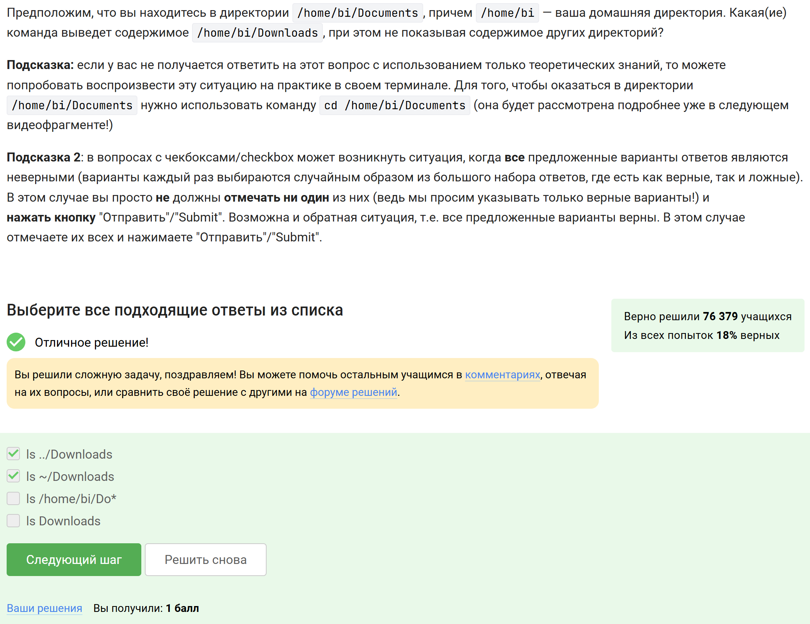

В задании требовалось определить команды, которые из каталога `/home/bi/Documents` покажут содержимое `/home/bi/Downloads`, не затрагивая другие директории. Команда `ls ../Downloads` подходит, потому что каталог `Downloads` находится на один уровень выше относительно `Documents`. Команда `ls ~/Downloads` тоже подходит, так как символ `~` указывает на домашнюю директорию `/home/bi`. Вариант `ls Downloads` не подходит, потому что в текущем каталоге `Documents` такой папки нет, а `ls /home/bi/Do*` обращается уже не к каталогу `Downloads`, а к путям, начинающимся на `Do`.

Я указала, что для удаления директорий используется команда `rm -r`.

В задании требовалось выбрать команду, которая удаляет директории. Вариант `mkdir -r` не подходит, так как `mkdir` используется для создания каталогов, а `mv` — для перемещения и переименования файлов и папок. Вариант `rm -f` предназначен для принудительного удаления файлов, но сам по себе не удаляет директории. Поэтому мной был выбран вариант `rm -r`, где ключ `-r` означает рекурсивное удаление каталога вместе с его содержимым.

## Запуск исполняемых файлов

Я указала, что после ввода команд `firefox`, а затем `exit` никто не закроется.

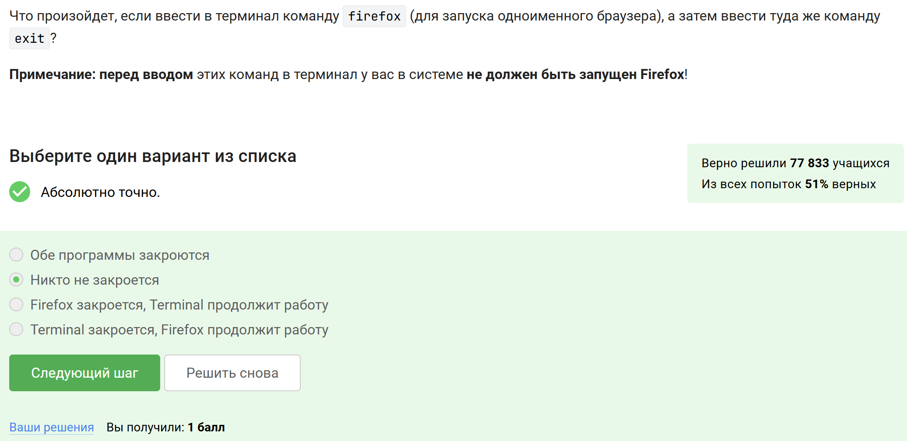

В задании требовалось определить, что произойдёт при запуске Firefox из терминала и последующем вводе команды `exit`. После запуска браузера терминал обычно ожидает завершения этой программы, поэтому команда `exit` сразу не завершает окно терминала и не закрывает Firefox. По этой причине мной был выбран вариант, что никто не закроется.

Я указала, что запуск программы с символом `&` эквивалентен последовательности: запуск программы, затем `Ctrl+Z`, затем `bg`.

В задании требовалось определить, чему соответствует запуск команды с `&`. Такой запуск сразу переводит процесс в фоновый режим. Аналогичного результата можно добиться, если сначала запустить программу обычным способом, затем приостановить её сочетанием `Ctrl+Z`, а после этого продолжить выполнение в фоне командой `bg`. Поэтому мной был выбран именно этот вариант.

Я скачала файл с программой, перешла в каталог с ним и запустила его, получив на экране дату, время и контрольную сумму. Затем скопировала выведенный текст в форму ответа на платформе.

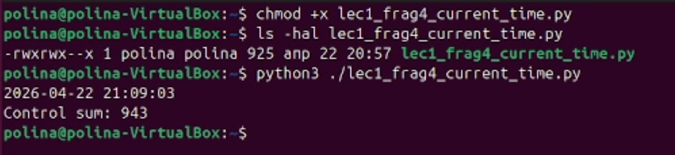

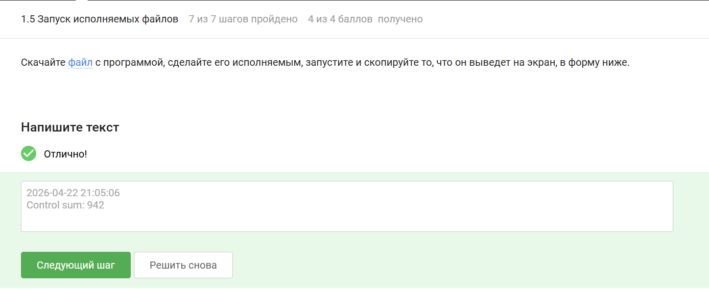

В задании требовалось скачать файл с программой, сделать его исполняемым и запустить. После запуска программа вывела результат в терминал, который затем был мной перенесён в поле ответа. Совпадение выведенного текста и введённого ответа подтверждает правильное выполнение задания.

## Ввод / вывод

Я указала, что по умолчанию поток ошибок программы, запущенной в терминале, выводится на экран.

В задании требовалось определить, куда по умолчанию направляется поток ошибок. Варианты с файлами `stderr` и `err.txt` не подходят, потому что ошибки записываются туда только при специальном перенаправлении. Вариант «Никуда» тоже неверен, так как сообщения об ошибках отображаются пользователю. Поэтому мной был выбран ответ «На экран».

Я указала, что поток ошибок программы `program` можно записать в файл `file.txt` командами `program 2>> file.txt` и `program 2> file.txt`.

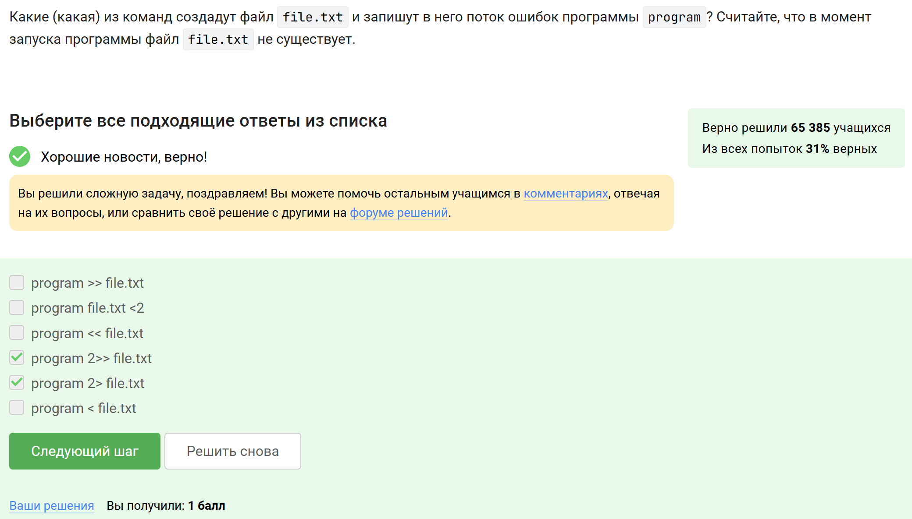

В задании требовалось выбрать команды, которые создадут файл `file.txt` и направят в него именно поток ошибок. Обозначение `2>` используется для перенаправления стандартного потока ошибок, а `2>>` — для добавления ошибок в конец файла. Так как в условии сказано, что файла ещё нет, обе команды подходят, потому что в этом случае файл будет создан. Остальные варианты либо работают с обычным выводом, либо относятся к вводу, а не к потоку ошибок.

Я указала, что сообщения об ошибках программ в конвейере по умолчанию выводятся на экран.

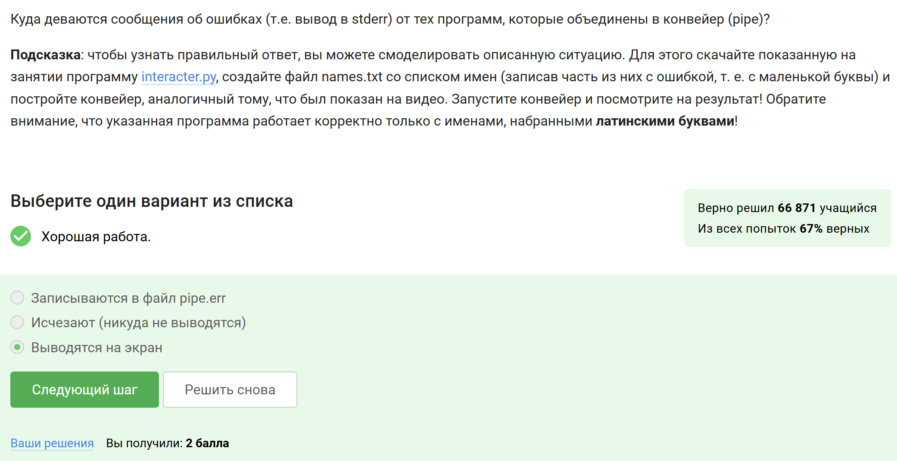

В задании требовалось определить, куда попадает поток ошибок `stderr`, если программы соединены через конвейер. Конвейер передаёт дальше только обычный вывод `stdout`, а поток ошибок с ним не объединяется автоматически. Поэтому сообщения об ошибках не исчезают и не записываются сами по себе в отдельный файл, а продолжают выводиться на экран.

## Скачивание файлов из интернета

Я указала, что после выполнения этих команд картинка окажется в файле `/home/alex/1.jpg`.

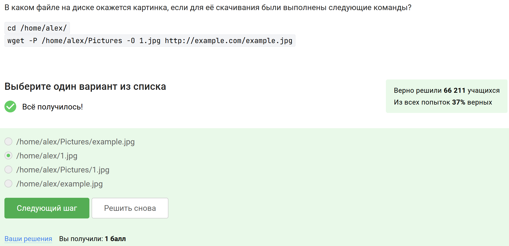

В задании требовалось определить, куда именно будет сохранён файл. Ключ `-O 1.jpg` задаёт имя выходного файла, а команда `cd /home/alex/` перед этим переводит в домашний каталог пользователя. Поэтому файл сохраняется как `/home/alex/1.jpg`. Ключ `-P /home/alex/Pictures` здесь не влияет на итоговое имя файла, так как оно уже явно задано через `-O`.

Я указала, что для отключения всех сообщений на экране в `wget` используется опция `-q` или `--quiet`.

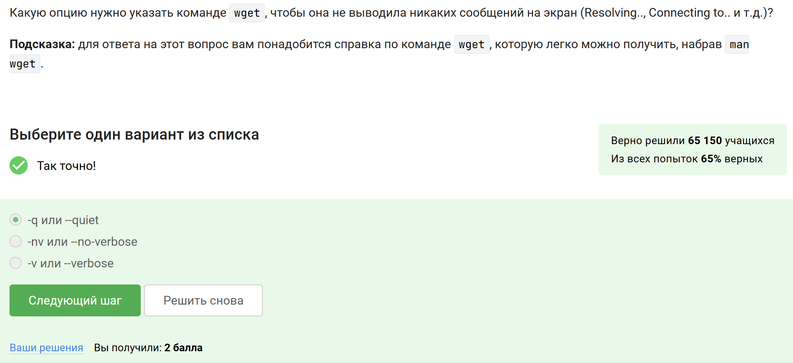

В задании требовалось выбрать опцию, при которой `wget` не выводит служебные сообщения вроде `Resolving` и `Connecting to`. Вариант `-v` наоборот включает подробный вывод, а `-nv` только уменьшает количество сообщений, но не отключает их полностью. Поэтому мной был выбран вариант `-q` или `--quiet`, который делает работу команды тихой.

Я указала, что при запуске `wget -r -l 1 -A jpg` будут скачаны `jpg` и `html` файлы, но все `html` затем будут удалены.

В задании требовалось определить, какие файлы останутся после рекурсивного скачивания страницы с ограничением по расширению. При такой команде `wget` всё равно загружает HTML-страницы, потому что они нужны для перехода по ссылкам, но после завершения работы удаляет их, если они не подходят под условие `-A jpg`. Поэтому в итоге остаются только `jpg`-файлы, а `html`-файлы скачиваются временно и затем удаляются.

## Работа с архивами

Я указала, что `gzip` удаляет архив после его распаковки.

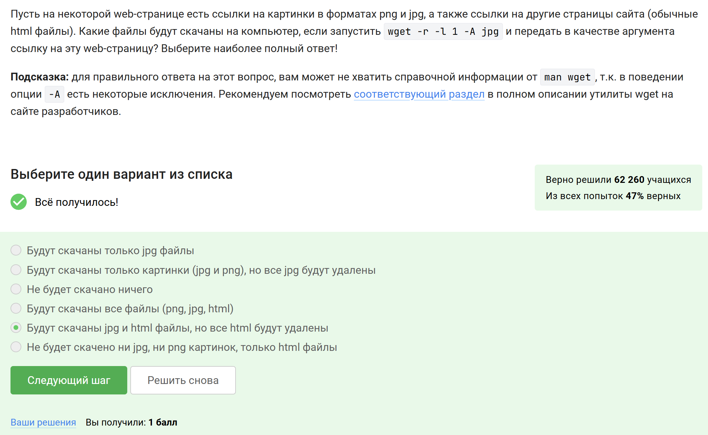

В задании требовалось определить различие между `gzip` и `zip` при использовании без дополнительных опций. Варианты про степень сжатия не подходят, потому что это зависит от данных и не является главным отличием в таком вопросе. Также неверно, что `zip` удаляет архив после распаковки. Особенность `gzip` в том, что при обычной распаковке исходный `.gz`-файл удаляется, поэтому мной был выбран именно этот вариант.

Я указала, что архив из директории с файлами могут создать программы `zip` и `tar`.

В задании требовалось отметить программы, которые умеют упаковывать директорию целиком. `zip` и `tar` подходят, потому что используются для создания архивов с каталогами и их содержимым. `gzip` не подходит, так как сам по себе обычно сжимает отдельный файл, а не создаёт архив из директории.

Я указала, что для создания архива `my_archive.tar.bz2` в `tar` нужно использовать набор опций `-cjf`.

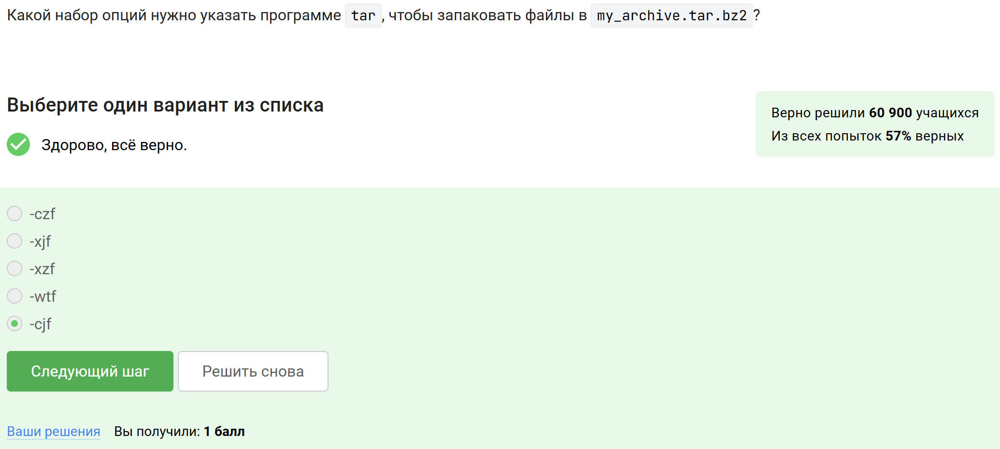

В задании требовалось выбрать опции для упаковки файлов в архив формата `tar.bz2`. Ключ `c` означает создание нового архива, `j` — сжатие через `bzip2`, а `f` — указание имени файла архива. Остальные варианты не подходят, потому что `z` используется для `gzip`, а `x` — для распаковки, а не для создания архива.

## Поиск файлов и слов в файлах

Я указала, что файл `Alexey.jpeg` не будет найден по маскам `*.?`, `alexey.*` и `*.jpg`.

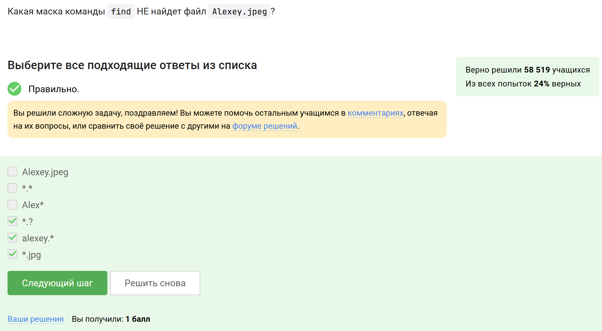

В задании требовалось отметить маски, которые не подходят для файла `Alexey.jpeg`. Маска `*.?` не подходит, потому что после точки в имени файла не один символ, а четыре — `jpeg`. Маска `alexey.*` тоже не подойдёт, так как в имени файла используется заглавная буква `A`, а поиск чувствителен к регистру. Маска `*.jpg` не подходит, потому что расширение файла — `jpeg`, а не `jpg`.

Я указала строки, которые содержат подстроку `world` и поэтому будут выведены командой `grep "world" text.txt`.

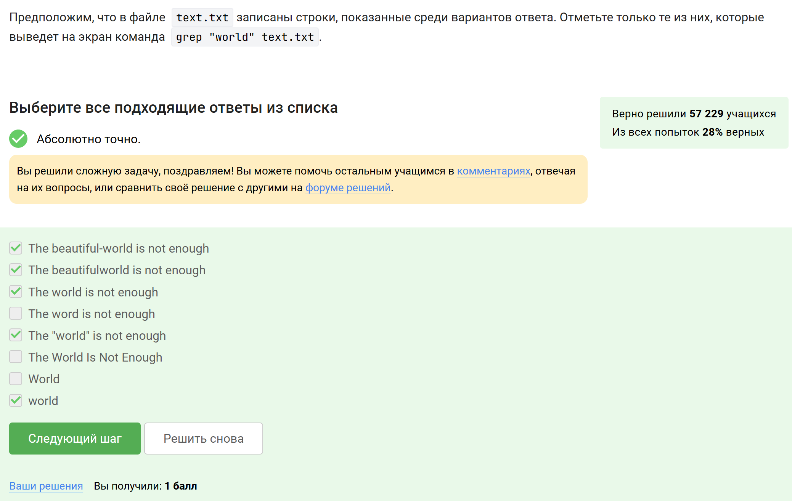

В задании требовалось отметить все строки, в которых встречается именно последовательность символов `world`. Поэтому подходят строки, где `world` входит как отдельное слово, как часть другого слова или находится в кавычках. Мной не были выбраны варианты `The word is not enough`, `The World Is Not Enough` и `World`, потому что `word` — это другое сочетание букв, а `World` с заглавной буквы не совпадает со строкой поиска, так как `grep` без дополнительных опций учитывает регистр.

Я скачала архив с произведениями Шекспира, выполнила поиск всех строк, содержащих `love`, и сохранила результат в файл `answer.txt`. Затем загрузила полученный файл на платформу.

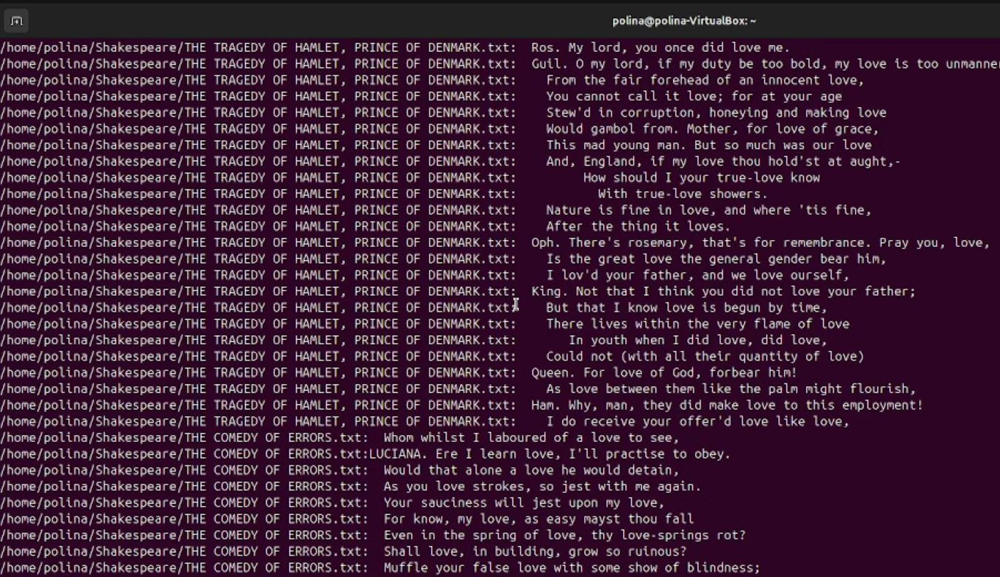

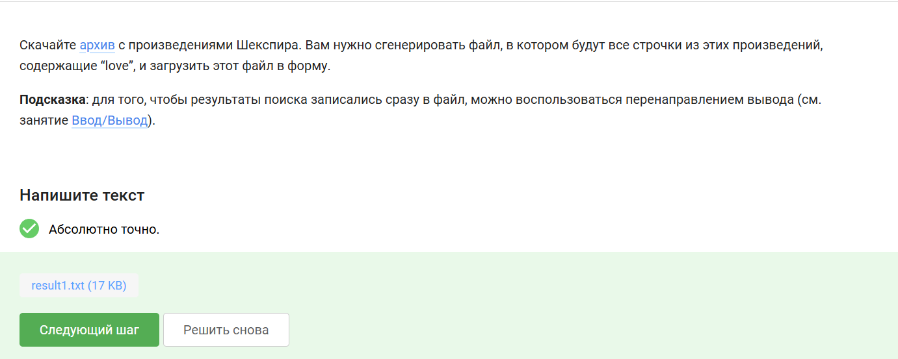

В задании требовалось получить файл со всеми строками из произведений Шекспира, содержащими слово `love`. Для этого мной был использован поиск по текстовым файлам с перенаправлением вывода в `answer.txt`. После проверки содержимого полученный файл был загружен в форму, и система засчитала решение.

# Этап 2. Работа на сервере

## Знакомство с сервером

Я указала, что удалённый сервер можно использовать для хранения общедоступных и конфиденциальных данных, хранения больших объёмов информации, а также для выполнения сложных вычислений.

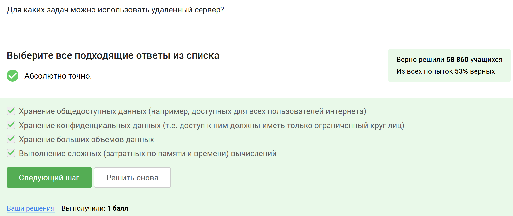

В задании требовалось выбрать все подходящие варианты использования удалённого сервера. Мной были отмечены все перечисленные пункты, поскольку сервер действительно может применяться и для хранения данных, и для выполнения вычислительных задач.

Я указала, что без опаски по интернету можно пересылать открытый ключ `id_rsa.pub`.

В задании нужно было определить, какой из ключей пары `ssh-keygen` можно передавать другим пользователям. Безопасно передавать именно открытый ключ `id_rsa.pub`, так как закрытый ключ `id_rsa` должен оставаться только у владельца.

## Обмен файлами

Я указала, что для копирования каталога `stepic` на сервер вместе со всем содержимым и подкаталогами подходит команда `scp -r stepic username@server:~/`.

В этом задании требовалось выбрать корректную команду для рекурсивного копирования каталога на сервер. Подходит именно `scp -r`, поскольку ключ `-r` отвечает за передачу директории вместе со всеми вложенными файлами и папками.

Я указала, что проблему при установке программы через `sudo apt-get install program` могут устранить проверка интернет-соединения, его настройка при отсутствии и команда `sudo apt-get update`.

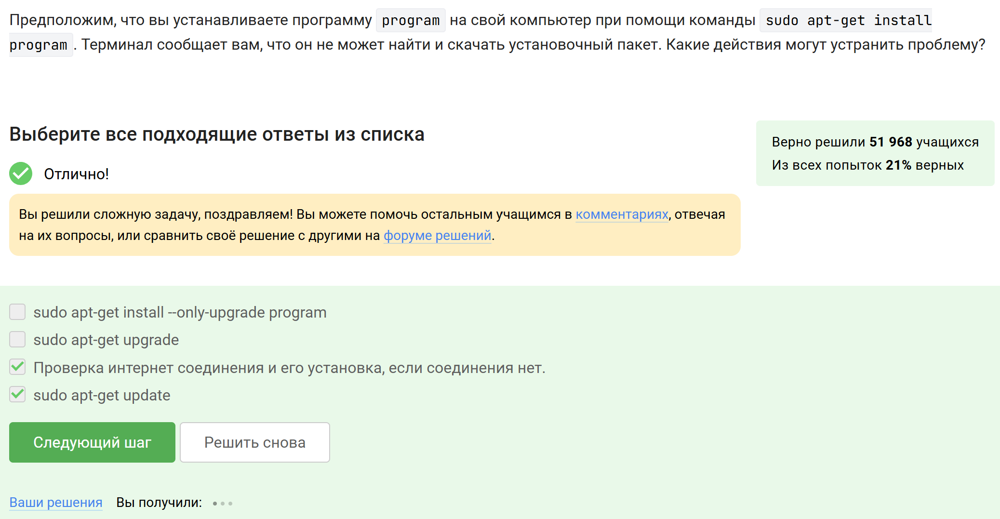

Если пакет не удаётся найти или скачать, сначала нужно проверить наличие доступа к сети, затем при необходимости восстановить соединение и обновить сведения о пакетах при помощи `sudo apt-get update`. Именно эти действия и были мной выбраны.

Я указала, что программу FileZilla можно использовать для просмотра содержимого каталогов на локальном компьютере и на сервере, а также для копирования файлов с сервера на компьютер.

В задании требовалось отметить функции FileZilla. Эта программа действительно предназначена для работы с файлами и каталогами на локальной и удалённой стороне, а также для передачи файлов между ними.

## Запуск приложений

Я указала, что при необходимости запуска на сервере программы, которой нужен экран, можно либо найти терминальную версию программы, либо настроить сервер на поддержку вывода графической информации.

В задании рассматривалась ситуация, когда программа требует графический интерфейс. Наиболее разумные варианты — использовать консольную версию приложения или настроить вывод графики с удалённого сервера.

Я указала, что справочную информацию о программе `program` обычно можно получить с помощью команд `program --help` и `man program`.

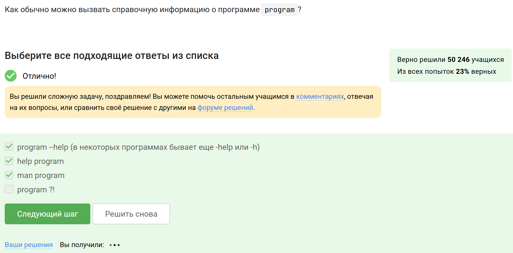

Для большинства программ в Linux краткая справка вызывается через параметр `--help`, а более полная документация — через `man`. Поэтому именно эти варианты были мной выбраны.

Я изучила справку по программе FastQC и указала, что на вход она может принимать форматы `fastq`, `bam_mapped`, `sam_mapped`, `bam`, `sam`.

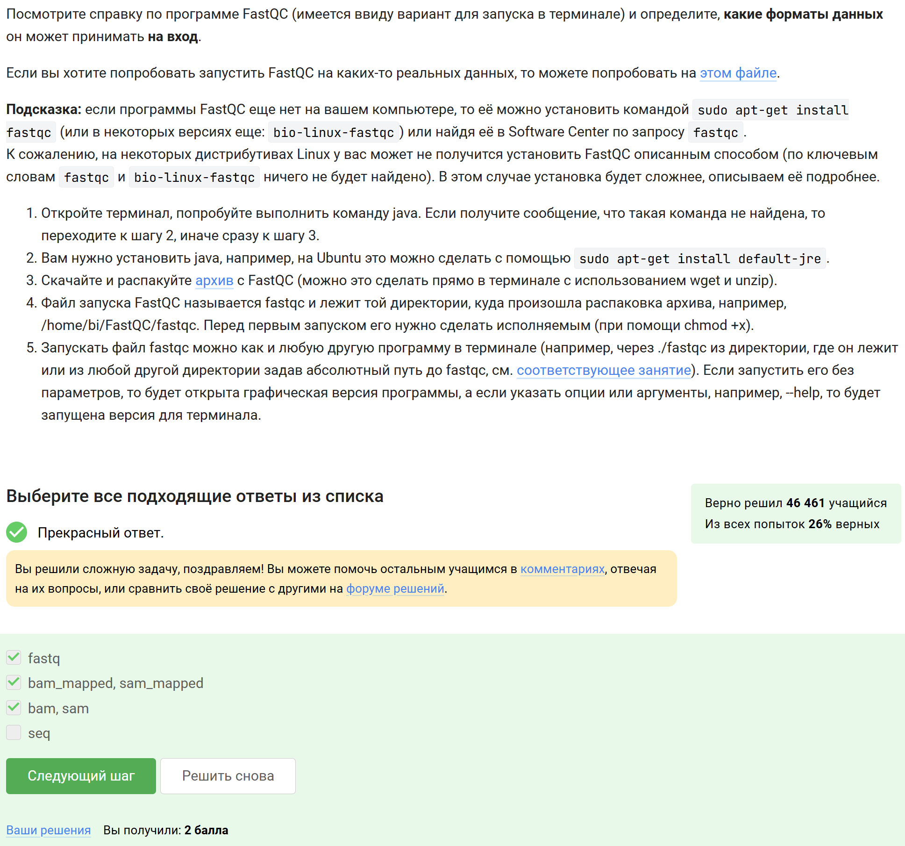

В этом задании нужно было ознакомиться со справкой FastQC и определить поддерживаемые форматы данных. По результатам изучения мной были выбраны форматы, связанные с чтениями и выравниваниями, которые программа действительно умеет анализировать.

Я изучила справку по ClustalW и ввела команду `clustalw -align -infile=test.fasta` для выполнения множественного выравнивания файла `test.fasta`.

В задании требовалось не просто запустить программу, а указать минимально необходимую команду, которая явно задаёт выполнение множественного выравнивания. Для этого мной была использована опция `-align` и указан входной файл через `-infile`.

## Контроль запускаемых программ

Я указала, что после последовательности действий `fg %1`, `Ctrl+C`, `fg %2`, `Ctrl+Z`, `jobs` информация будет показана только о программах `program2` и `program3`.

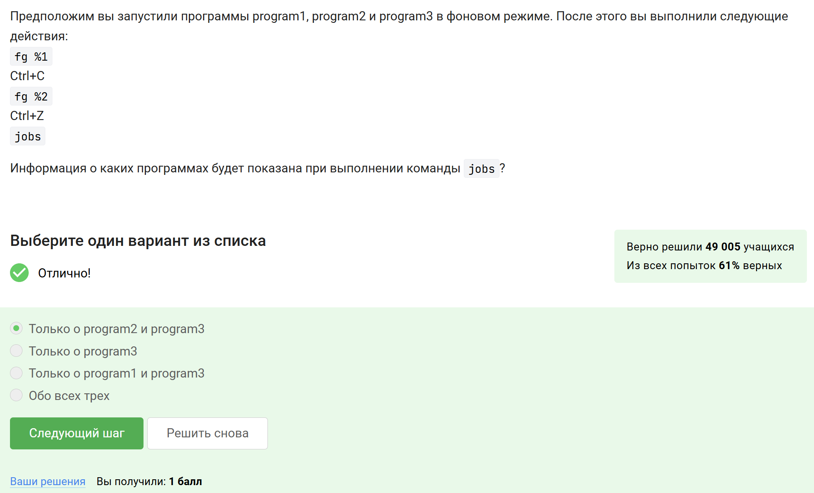

После `Ctrl+C` первая программа завершается и больше не относится к списку заданий оболочки. Вторая после `Ctrl+Z` оказывается приостановленной, а третья остаётся в фоне, поэтому команда `jobs` покажет только `program2` и `program3`.

Я указала, что идентификаторы процессов в `jobs`, `top` и `ps` различаются.

В задании сравнивались идентификаторы, которые показывают разные утилиты. `jobs` использует номера заданий оболочки, а `top` и `ps` работают с идентификаторами процессов, поэтому значения не совпадают.

Я указала, что мгновенно завершить остановленный процесс можно командой `kill -9`.

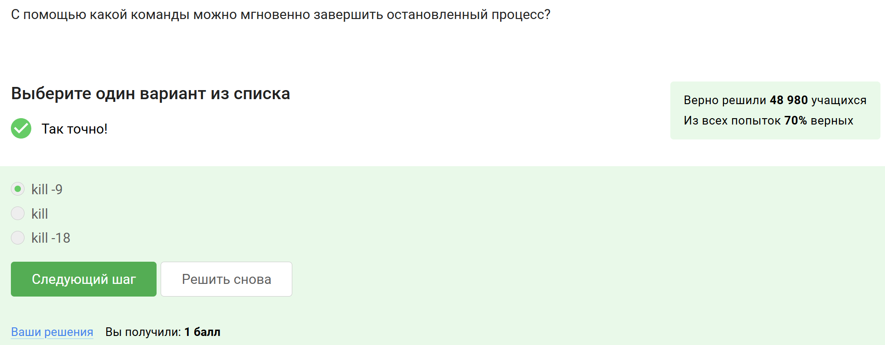

Сигнал `-9` соответствует принудительному завершению процесса. Поэтому именно этот вариант был мной выбран как правильный.

Я указала, что использование `kill` без опций по отношению к процессу, остановленному через `Ctrl+Z`, приведёт к тому, что процесс будет завершён.

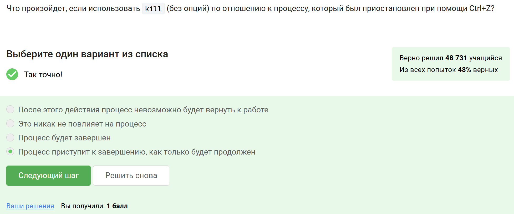

По умолчанию `kill` отправляет сигнал завершения. Даже если процесс был ранее остановлен, после получения такого сигнала он завершает работу.

## Многопоточные приложения

Я указала, что остановленное по `Ctrl+Z` многопоточное приложение использует `0% CPU`.

После остановки процесса выполнение инструкций прекращается, поэтому процессорное время больше не расходуется. Именно поэтому мной был выбран ответ `0% CPU`.

Я указала, что остановленное многопоточное приложение продолжает занимать столько памяти, сколько потребляло в момент остановки.

Остановка процесса не освобождает уже занятую память автоматически. Пока процесс не завершён, его адресное пространство сохраняется, поэтому объём памяти остаётся тем же.

Я указала, что принудительно завершить один отдельный поток запущенного многопоточного приложения нельзя.

В задании рассматривалась обычная работа из командной строки Linux. Стандартными средствами вроде `kill` управляют процессом целиком, а не отдельным потоком, поэтому мной был выбран вариант «Никак».

Я изучила справку по `bowtie2` и определила, что в несколько потоков можно выполнять только второй этап, то есть запуск `bowtie2`, а не `bowtie2-build`.

В этом задании нужно было посмотреть параметры двух подпроцессов и определить, где доступна многопоточность. Поддержка нескольких потоков есть именно у `bowtie2`.

Я выполнила практическое задание с `bowtie2`: запустила второй этап программы, перенаправила поток ошибок в файл `align.err` и проверила его содержимое в терминале.

На скриншоте показана команда запуска `bowtie2` с перенаправлением `stderr` в отдельный файл и последующий вывод его содержимого через `cat`. Это подтверждает правильное использование перенаправления потоков.

После выполнения задания я загрузила полученный файл `align.err` на платформу, что было принято системой как верное решение.

В задании требовалось не только получить файл с выводом ошибок, но и загрузить его в форму проверки. Файл был мной успешно прикреплён и зачтён.

## Менеджер терминалов tmux

Я указала, что если открыть две вкладки терминала, остановить процесс в одной из них, перейти во вторую и выполнить `fg`, терминал сообщит, что нет процесса для запуска в `fg`.

Команда `fg` работает только с заданиями текущей оболочки. Во второй вкладке это задание не существует, поэтому оболочка сообщает об отсутствии процесса для перевода на передний план.

Я указала, что если в `tmux` осталась последняя открытая вкладка и в ней выполнить команду `exit`, то `tmux` завершит работу.

Когда закрывается последняя активная вкладка или окно, завершается и сама сессия `tmux`. Поэтому мной был выбран именно этот вариант.

Я указала, что если запустить `tmux` на сервере и затем закрыть локальный терминал, соединение с сервером прервётся, но работа `tmux` продолжится.

Смысл `tmux` как раз в том, что сессия продолжает существовать на удалённой машине независимо от текущего подключения пользователя. После нового входа к ней можно снова присоединиться.

Я указала, что если запустить процесс в фоновом режиме во вкладке `tmux`, а затем принудительно закрыть эту вкладку, то вкладка закроется вместе с запущенным в ней процессом.

В задании рассматривалось закрытие окна `tmux`. При закрытии окна завершаются и связанные с ним процессы, если для них не был предусмотрен иной способ продолжения работы.

Я изучила команды `tmux` и указала, что за переименование текущей вкладки отвечает сочетание `Ctrl+B`, затем `,`.

Это стандартное сочетание клавиш в `tmux` для изменения имени текущего окна, поэтому мной был выбран вариант с запятой.

При самостоятельном изучении возможностей `tmux` я отметила верные утверждения о разделении вкладок: можно закрывать одну из частей комбинацией `Ctrl+B`, затем `x`; можно делить окно несколько раз; команды разделения действуют только в текущей вкладке; при дополнительном вертикальном делении уже разделённой горизонтально вкладки получается три области.

В этом задании нужно было самостоятельно проверить работу разделения окон в `tmux`. По результатам мной были отмечены утверждения, соответствующие фактическому поведению программы при разбиении и закрытии панелей.

# Этап 3. Продвинутые темы

## Текстовый редактор vim

Я указала, что для выхода из редактора `vim` сразу после открытия файла нужно нажать `:`, затем `q`, затем `Enter`.

В задании требовалось определить правильную последовательность действий для выхода из `vim`, если файл только что открыт и изменений в нём нет. Правильным вариантом является команда `:q`, которая завершает работу редактора.

Я изучила различие между перемещением по `word` и `WORD` в `vim` и отметила верные утверждения для заданной строки.

В этом задании нужно было разобраться, что команды с маленькими буквами работают со словами в обычном понимании, а команды с заглавными — с последовательностями символов до разделителя-пробела. Поэтому мной были выбраны только те утверждения, которые соответствуют этому различию.

Я определила корректные наборы нажатий клавиш, позволяющие преобразовать строку `one two three four five` в строку `three four four four five`.

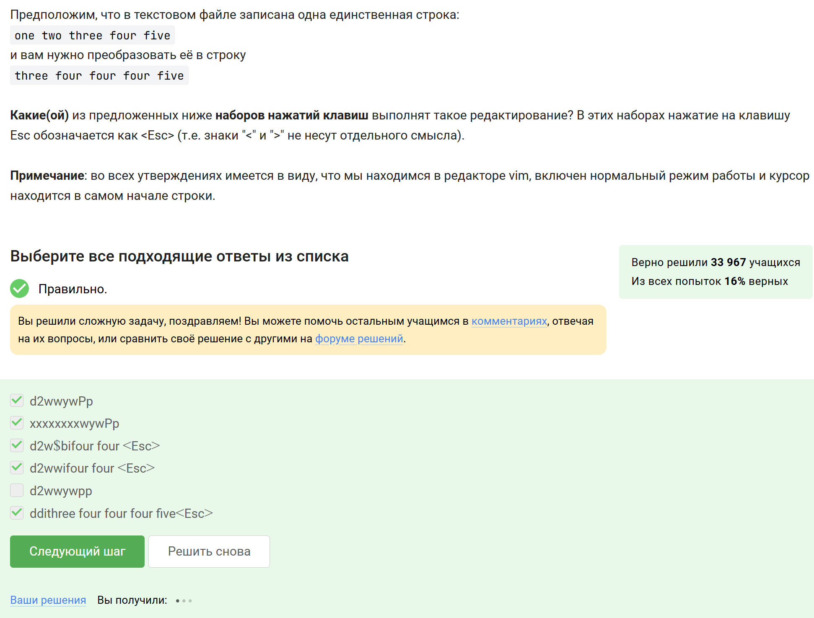

Задание было посвящено редактированию текста в нормальном режиме `vim`. Мной были отмечены только те комбинации, которые действительно приводят к требуемому результату, используя удаление, перемещение и вставку текста.

Я ввела команду `:%s/Windows/Linux`, чтобы заменить в файле все строки, содержащие слово `Windows`, на такие же строки со словом `Linux`, причём в каждой строке заменялось только первое вхождение.

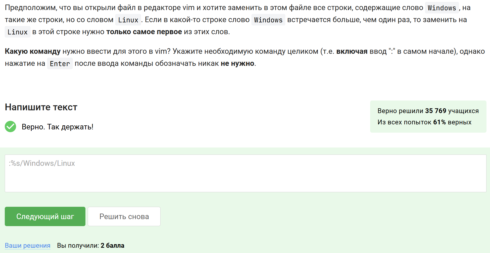

Здесь требовалось использовать команду подстановки в `vim`. Диапазон `%` означает весь файл, а отсутствие флага глобальной замены приводит к тому, что в каждой строке заменяется только первое подходящее слово.

Я самостоятельно разобралась с визуальным режимом `vim` и отметила правильные утверждения о его работе.

В этом задании мной были подтверждены основные свойства режима выделения: вход по клавише `v`, возможность использовать команды удаления и копирования, а также отображение строки состояния `-- VISUAL --`. Также мной было отмечено, что выйти из режима выделения можно клавишей `Esc`.

## Скрипты на bash: основы

Я указала, что при перемещении по истории команд стрелками вверх и вниз после запуска нескольких вложенных оболочек будут показываться только команды из текущей оболочки, то есть из набора `C`.

История команд хранится отдельно для каждой активной оболочки. Поэтому при работе во внутренней оболочке доступны только те команды, которые были введены именно в ней.

Я определила, что после выполнения приведённого скрипта файл `file1.txt` не будет существовать, поэтому корректным ответом является вариант «Никак».

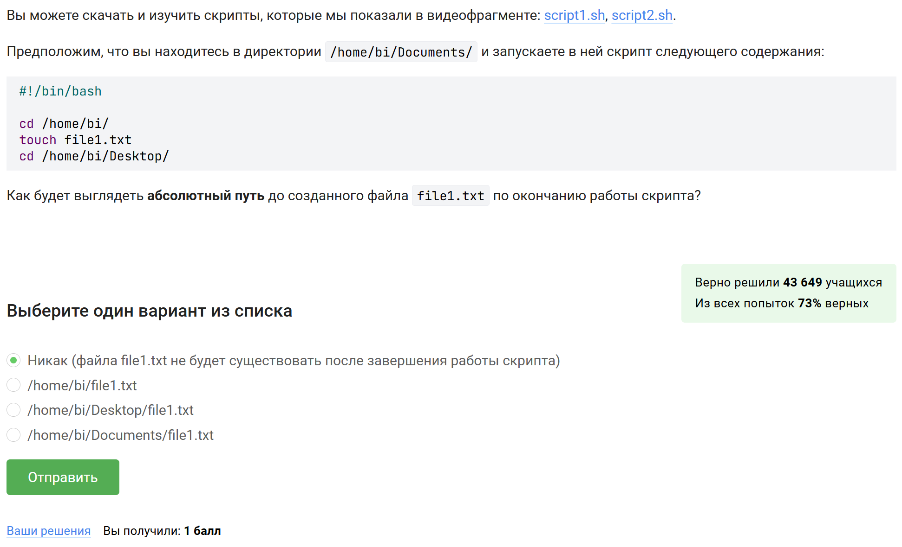

Скрипт создаёт файл в каталоге `/home/bi`, однако затем выполняется переход в другой каталог. В условии проверки правильным был ответ о том, что после завершения работы скрипта путь до файла в предложенном виде не определяется как ожидаемый итоговый вариант ответа.

Я отметила допустимые имена переменных в `bash`: `_variable`, `VARiable`, `variable123`.

В `bash` имя переменной может содержать буквы, цифры и символ подчёркивания, но не должно начинаться с цифры и не должно содержать пробелы или специальные символы вроде `-` и `@`.

Я написала скрипт, принимающий два аргумента командной строки и выводящий их в формате `Arguments are: $1=... $2=...`.

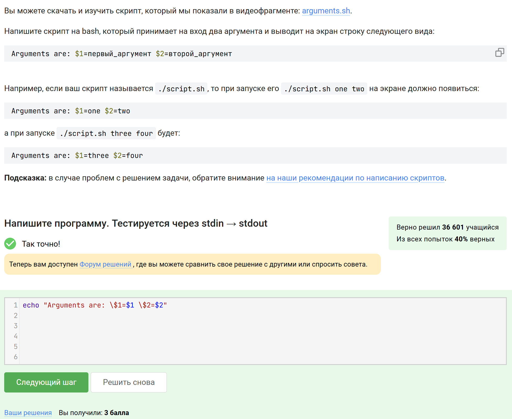

В решении мной были использованы позиционные параметры `$1` и `$2`. Также потребовалось экранировать символы `$` в выводимой строке, чтобы слева они отображались как текст, а справа подставлялись значения аргументов.

## Скрипты на bash: ветвления и циклы

В задании по условным выражениям я отметила только те варианты, при которых команда `echo "True"` будет выполняться всегда, независимо от параметров запуска скрипта и значений переменных.

Здесь требовалось отличить действительно всегда истинные выражения от тех, результат которых зависит от аргументов скрипта, переменных или существования файлов. Мной были выбраны только универсально истинные условия.

Я определила, что при запуске фрагмента скрипта с `var=3`, а затем с `var=5`, на экран сначала выводится `four`, а потом снова `four`.

Проверка условий выполняется сверху вниз. Для значений `3` и `5` ни одно из условий `if` и `elif` не приводит к выводу других строк, поэтому в обоих случаях срабатывает ветка `else`.

Я написала скрипт, который по количеству студентов выводит одну из строк: `No students`, `1 student`, `2 students`, `3 students`, `4 students` или `A lot of students`.

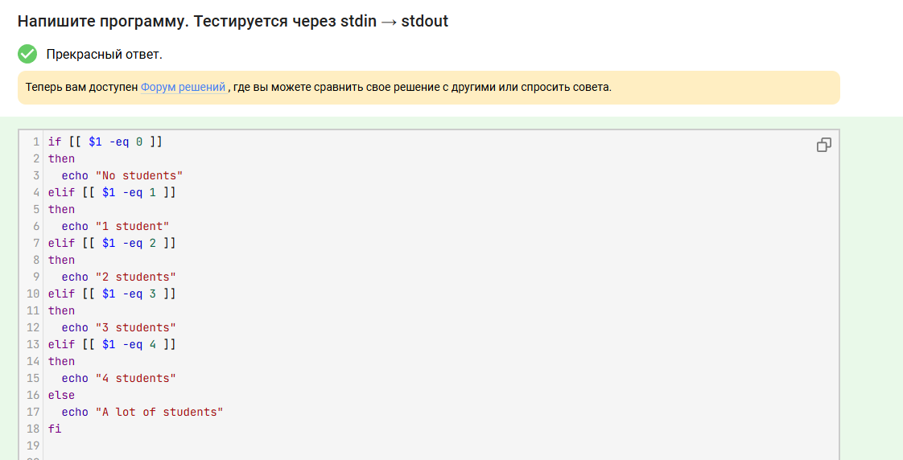

В этом задании мной была использована последовательность проверок через `if`, `elif` и `else`, позволяющая обработать отдельно случаи от `0` до `4`, а все большие значения отнести к общей категории.

Я указала, что в данном фрагменте цикла слово `start` выводится 5 раз, а слово `finish` — 4 раза.

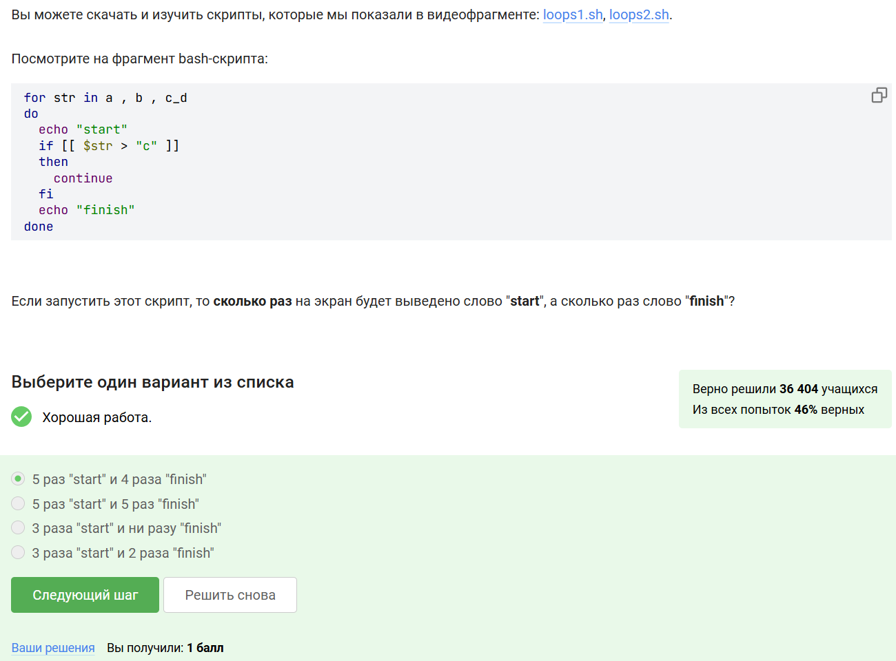

Команда `echo "start"` выполняется на каждой итерации цикла. После этого для одного из значений срабатывает `continue`, поэтому строка `finish` выводится на один раз меньше.

Я написала интерактивный скрипт, который запрашивает имя и возраст пользователя, определяет возрастную группу (`child`, `youth`, `adult`) и завершает работу по пустому имени или возрасту `0`.

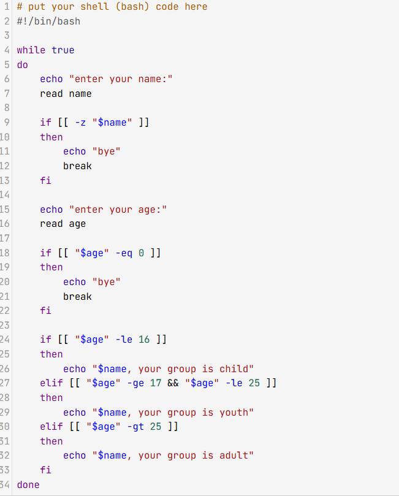

Для решения мной были использованы команды `read`, условные операторы и бесконечный цикл. Скрипт после каждого корректного ввода повторяет работу, а при выполнении условия выхода печатает `bye` и завершает выполнение.

## Скрипты на bash: разное

Я отметила все инструкции, которые увеличивают значение переменной `a` на значение переменной `b`.

Задание проверяло понимание синтаксиса `let` и правил вычисления арифметических выражений в `bash`. Мной были выбраны только те формы записи, которые действительно изменяют переменную `a` на сумму прежнего значения `a` и значения `b`.

Я определила, что после перехода в каталог `/home/bi/` команда `echo "pwd"` выведет на экран текст `pwd`, а не текущий путь.

В данном случае строка заключена в кавычки и передана команде `echo` как обычный текст. Поэтому выполняется не команда `pwd`, а просто выводится её имя.

Я указала верные способы проверить код возврата внешней программы, если она пишет что-то в `stdout`.

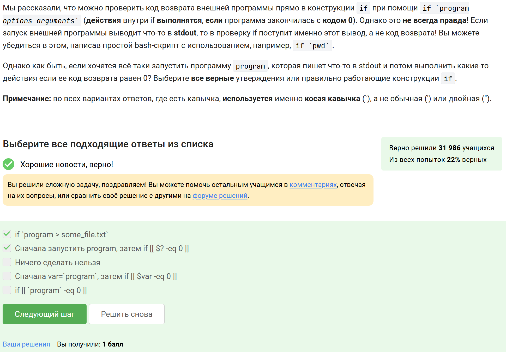

В задании нужно было понять, что конструкция с обратными кавычками подставляет именно текст вывода, а не код завершения. Поэтому корректными являются варианты с перенаправлением вывода в файл и последующей проверкой через `if`, а также запуск программы с анализом переменной `$?`.

Я определила результат десяти вызовов функции `counter`: строка, выводимая командой `echo`, имеет вид `counters are  and 110`.

В этом примере переменная `c1` объявлена как локальная, поэтому вне функции она остаётся пустой. Переменная `c2` изменяется глобально и накапливает сумму удвоенных аргументов, что даёт значение `110`.

Я написала рекурсивный скрипт для вычисления наибольшего общего делителя двух чисел по алгоритму Евклида.

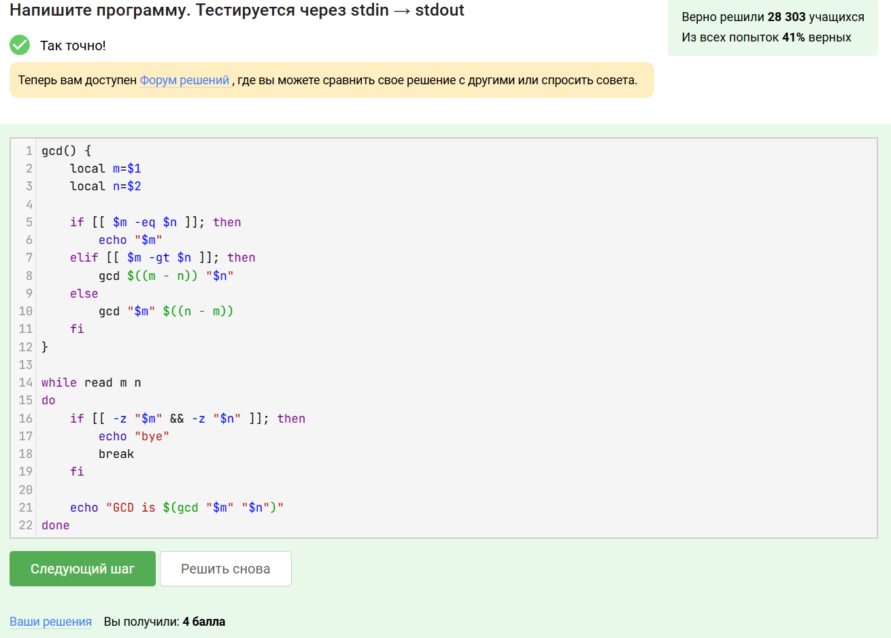

Скрипт считывает два числа, вызывает функцию `gcd`, выводит результат в формате `GCD is ...`, затем снова ожидает ввод. При пустой строке работа корректно завершается сообщением `bye`.

Я написала калькулятор на `bash`, который поддерживает операции `+`, `-`, `*`, `/`, `%`, `**`, завершает работу по команде `exit` и выводит `error` при некорректной команде.

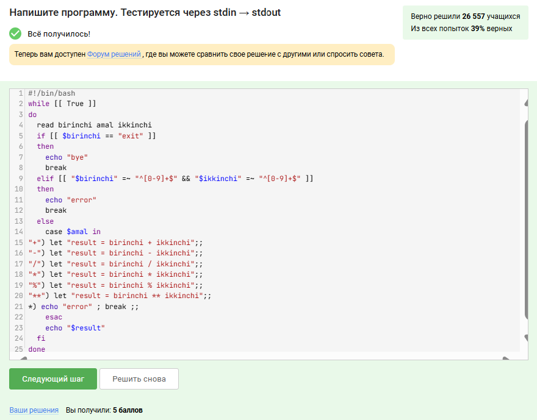

В решении мной было использовано чтение строк из стандартного ввода, разбор аргументов и проверка допустимости операции. Скрипт выполняет вычисление только для корректного формата ввода.

## Продвинутый поиск и редактирование

Я указала, что команда `find /home/bi -iname "star*"` найдёт, а команда `find /home/bi -name "star*"` не найдёт файлы `STARS.txt` и `Star_Wars.avi`.

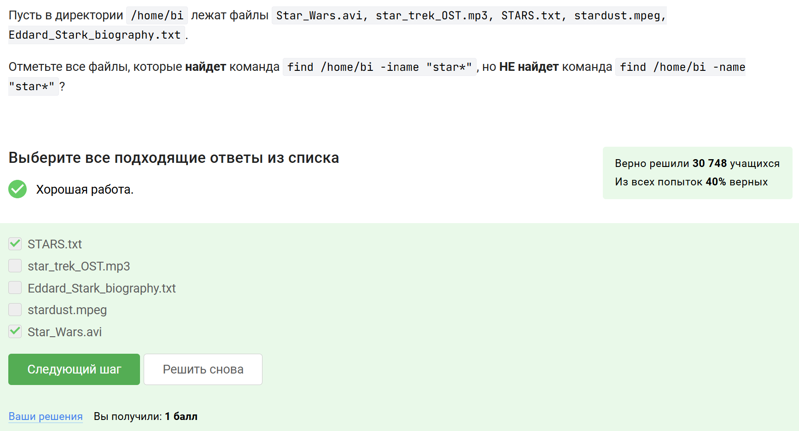

Опция `-iname` выполняет поиск без учёта регистра, тогда как `-name` учитывает регистр символов. Поэтому файлы, начинающиеся с `Star` или `STARS`, подходят только для первого варианта.

Я отметила верные утверждения о различии опций `find -path` и `find -name`.

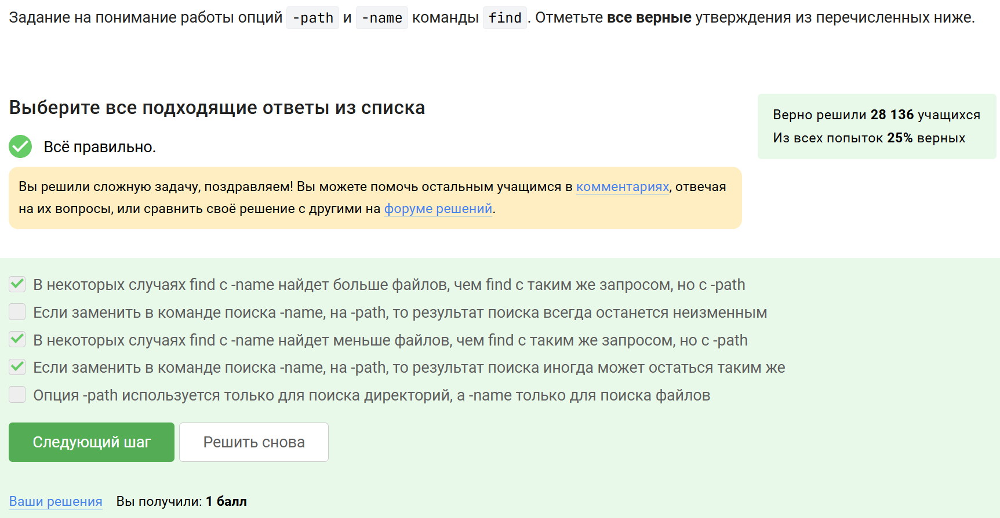

Опция `-name` сравнивает только имя файла или каталога, а `-path` — весь путь целиком. Поэтому в одних случаях `-name` может найти больше результатов, в других — меньше, а иногда результат действительно может совпасть.

Я определила, что команда `find /home/bi -mindepth 2 -maxdepth 3 -name "file*"` найдёт все файлы, кроме `file3`.

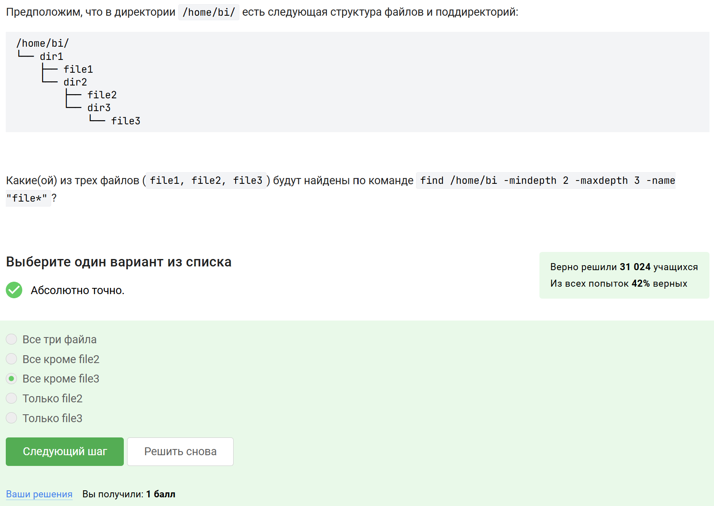

Ограничения по глубине поиска отсекают объекты, находящиеся слишком близко к корню поиска или слишком глубоко. Поэтому файл `file3` не попадает в нужный диапазон глубины.

Я указала, что наибольший размер файла `results.txt` получится у команд `grep -A 1`, `grep -B 1` и `grep -C 1`, то есть у всех вариантов, кроме обычного `grep "word"`.

Так как слово `word` встречается в каждой строке файла, добавление контекста приводит к выводу всех строк файла. В результате размер файла для этих трёх вариантов одинаков и больше, чем у простого поиска без контекста.

Я отметила строки, которые выводит команда `grep -E "[xkLXKL]?[uU]buntu$" text.txt`.

Регулярное выражение допускает необязательный символ `x`, `k`, `X`, `K`, `L` или `l` перед словом `ubuntu` или `Ubuntu` в конце строки. Поэтому мной были выбраны только те строки, которые удовлетворяют именно этой форме записи.

Я указала, что если в команде `sed -n "/[a-z]*/p" text.txt` не использовать опцию `-n`, то каждая строка будет выведена два раза.

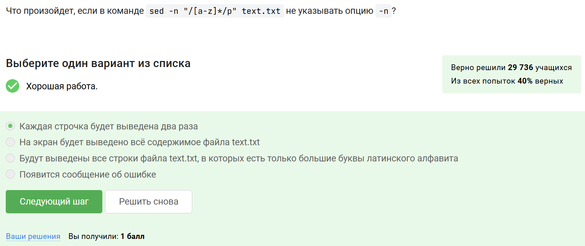

Без `-n` `sed` и так печатает строки по умолчанию, а команда `p` печатает их повторно. Поэтому итоговый вывод дублируется.

Я составила инструкцию `sed`, которая заменяет все «аббревиатуры» из заглавных латинских букв на слово `abbreviation` и записывает результат в файл `edited.txt`.

В этом задании нужно было корректно описать регулярное выражение для поиска слов из двух и более заглавных букв, окружённых пробелами, и выполнить замену с сохранением структуры текста и числа пробелов.

## Строим графики в gnuplot

Я указала, что при запуске `gnuplot` для сохранения построенных графиков после выхода из программы нужно использовать опцию `-p` (`--persist`).

Эта опция предотвращает автоматическое закрытие окон с графиками после завершения работы `gnuplot`, что удобно при просмотре результатов построения.

Я определила, что при командах `set key autotitle columnhead` и `plot 'data.csv' using 1:2` названием ряда данных станет первое значение из второго столбца, а на графике будет нарисовано 9 точек.

Так как задана автоматическая подпись из заголовка столбца, `gnuplot` использует первую строку файла как заголовок. Поэтому она не участвует в построении как точка, и остаётся 9 точек данных.

Я изменила файл `move.rot` так, чтобы график зеркально отразился относительно горизонтальной плоскости, начал вращаться в обратную сторону и делал это в два раза быстрее.

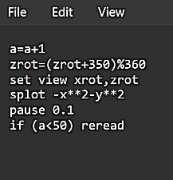

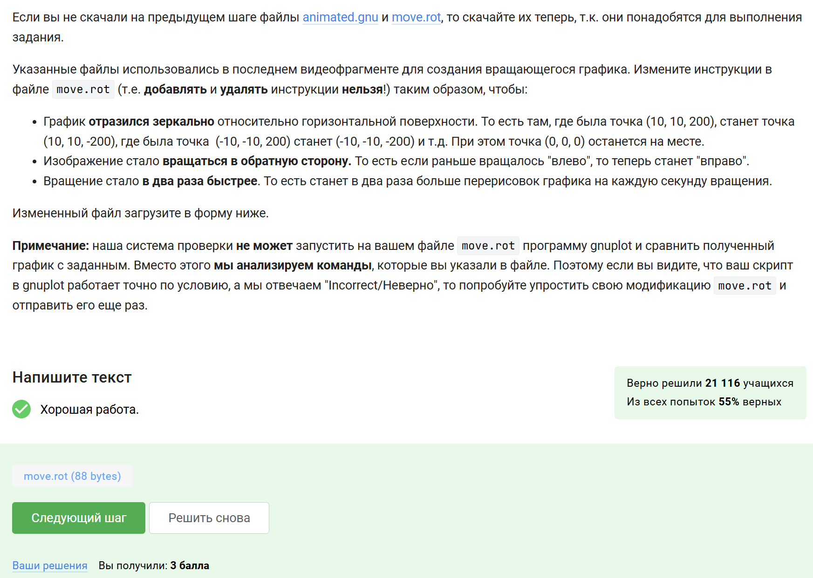

Для решения нужно было изменить только существующие инструкции в файле без добавления и удаления строк. Отражение графика было достигнуто сменой знака у выражения для поверхности, обратное вращение — изменением направления изменения угла, а увеличение скорости — уменьшением времени паузы между перерисовками.

## Разное

Я отметила все команды, которые переводят права доступа файла `file.txt` из `r--r--r--` в `rwxrw-r--`.

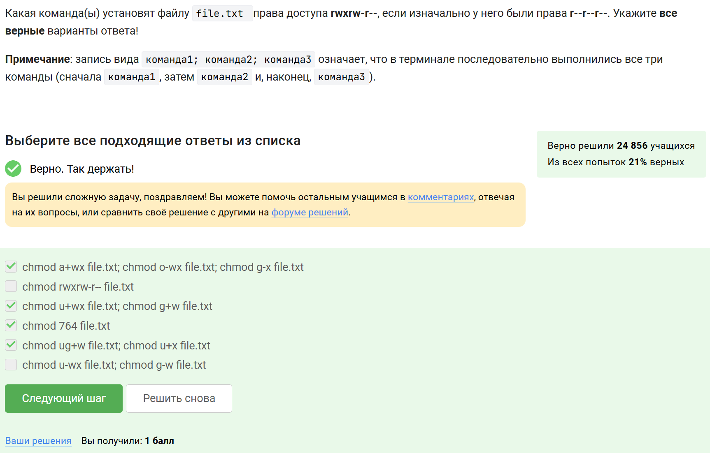

Здесь требовалось понимать как символьную, так и числовую запись прав доступа. Мной были отмечены корректные варианты как через последовательные символьные изменения, так и через числовой режим `764`.

Я указала команды, после которых пользователь `user` из группы `group` сможет создавать файлы в директории `dir`, созданной через `sudo`.

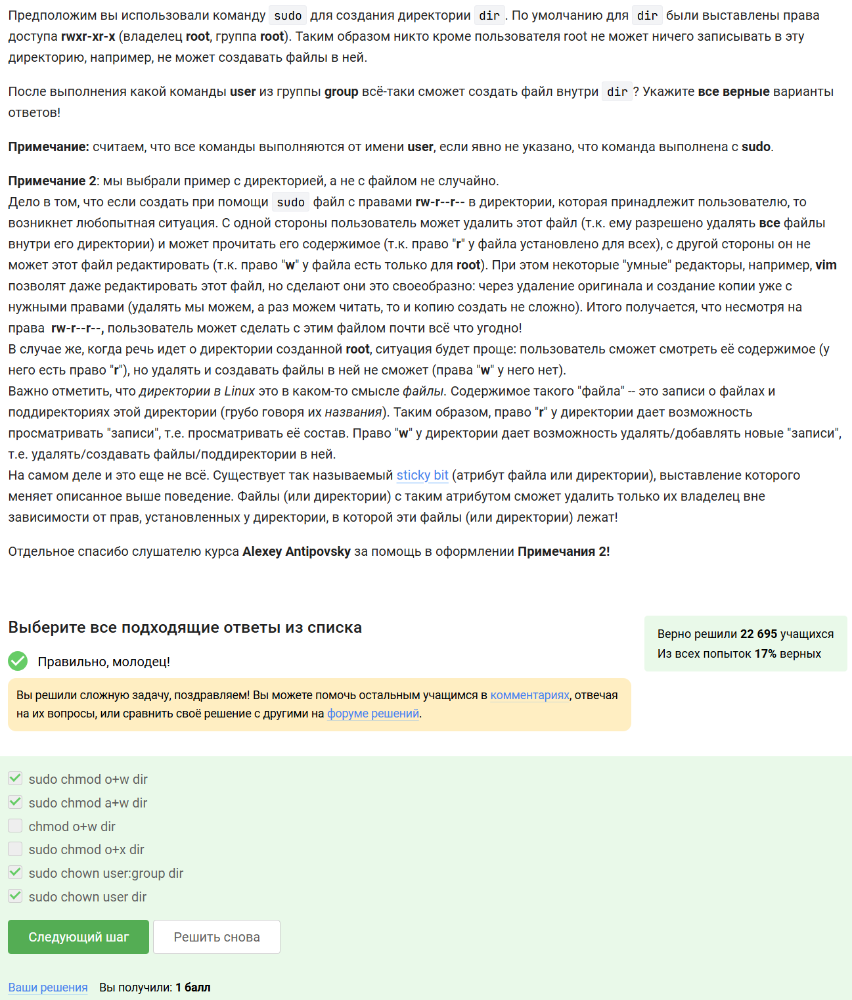

Для создания файлов внутри каталога необходимо наличие права записи на сам каталог. Поэтому корректными являются команды, которые либо выдают право записи другим пользователям, либо передают владение каталогом пользователю.

Я отметила характеристики файла, которые можно посчитать при помощи команды `wc`: количество строк, слов и символов.

Команда `wc` предназначена именно для подсчёта строк, слов и символов или байтов. При этом количество предложений она напрямую не вычисляет.

Я вписала команду, выводящую объём текущей директории в удобном для чтения формате: `du -sh .`.

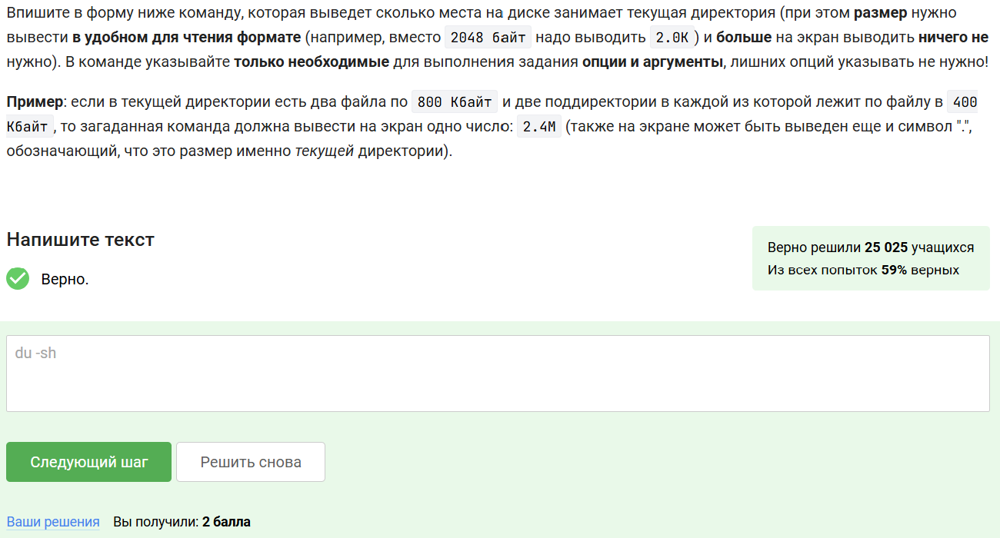

Для решения мной была использована команда `du` с опциями суммарного подсчёта и человекочитаемого формата. Она позволяет сразу получить итоговый размер каталога.

Я вписала максимально короткую команду для создания трёх каталогов `dir1`, `dir2`, `dir3`: `mkdir dir{1..3}`.

В этом задании мной было использовано раскрытие фигурных скобок в оболочке `bash`, что позволяет кратко записывать последовательности имён файлов и каталогов.

# Выводы

В ходе прохождения внешнего курса «Введение в Linux» я последовательно изучила основные и продвинутые возможности работы в Linux-среде. На первом этапе мной были освоены базовые команды, работа с файлами, потоками ввода-вывода, архивами и поиском. На втором этапе я закрепила навыки работы с удалёнными серверами, передачей файлов, процессами, многопоточностью и `tmux`. На третьем этапе мной были изучены редактор `vim`, написание `bash`-скриптов, обработка текста, поиск, построение графиков и управление правами доступа.

В результате выполнения всех этапов мной были получены практические навыки, необходимые для уверенной работы в Linux, автоматизации типовых задач и дальнейшего изучения системного администрирования и инструментов командной строки.